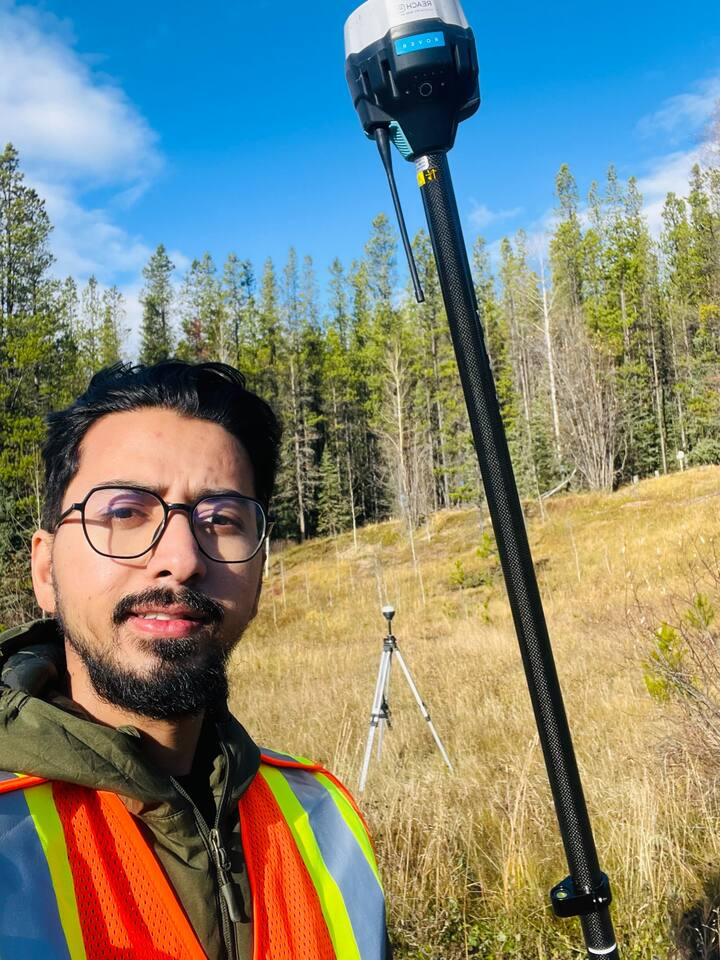

# Developer



## Santosh Ayer

I am a Graduate Research Assistant Fellow and graduate researcher in
Forest Biology and Management at the University of Alberta, Canada. My
graduate research evaluates how forest growth-and-yield models represent
forest responses to thinning and how differences among modelling
approaches affect the interpretation of stand development and
forest-management outcomes.

My broader research interests include forest biometrics, forest
inventory, allometry, biomass and carbon estimation, growth modelling,
and emerging approaches for tree measurement. Across these areas, I am
particularly interested in making analytical methods transparent,
reproducible, and practical for research, education, and forest
management.

I want to contribute to Nepal’s forestry sector by developing accessible
and scientifically defensible tools that connect forestry research with
education and operational decision-making. This goal guides the
development of ***nepalallometry*** and my wider research on Nepal’s
forest measurement and allometric challenges.

[Google
Scholar](https://scholar.google.ca/citations?user=gjUyDikAAAAJ&hl=en) ·
[GitHub](https://github.com/ayersant-sys)

## Role in ***nepalallometry***

I am the developer and maintainer of ***nepalallometry***, an extensible
umbrella R package for allometric estimation relevant to Nepal’s forest
trees. The first release focuses on biomass and carbon estimation
through
[`biomass()`](https://ayersant-sys.github.io/nepalallometry/dev/reference/biomass.md),
while the package is structured to support additional Nepal-relevant
allometric and inventory tools in future releases.

The package implements published methods but does not claim authorship
of the underlying equations. Each model, dataset, regulatory document,
and conversion factor is credited to its original source through the
package reference registry.

``` r

allometry_references()
```

## Future development

Planned directions for ***nepalallometry*** include additional
allometric models and species, stem-volume estimation, height-diameter
relationships, and other practical inventory modules where appropriate
equations and supporting evidence are available. New components will
continue to document their sources, units, calibration domains,
assumptions, and limitations explicitly.
